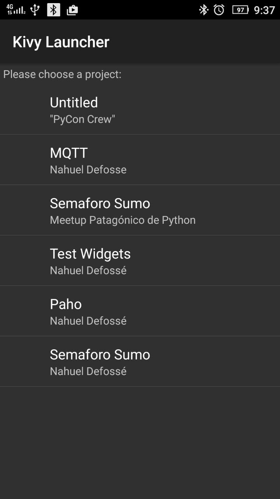

# Software para torneo de robótica

## Requisitos
 -  Kivy 1.9

## Ejecución desde Kivy Launcher

# Utilizando la aplicación Kivy Launcher

Kivy Launcher permite ejecutar proyectos Kivy sin necesidad de generar el APK.
Se descarga desde: https://play.google.com/store/apps/details?id=org.kivy.pygame&hl=es

